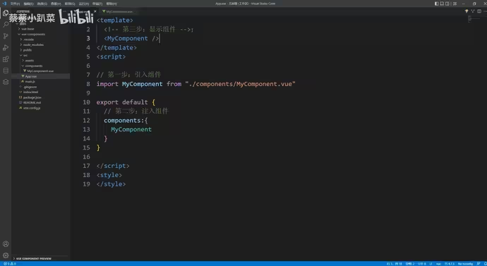

Vue应用:

从引入VUE开始：Vimport { createApp } from 'vue'
创建一个VUE实例对象，每一个项目只有一个VUE实例对象：const app = createApp(app)
	每一个项目都需要一个根组件，其他组件将作为其子组件，组件层层嵌套。

挂载渲染到容器中：app.mount('#app')
	这里的#app对应的是index.html中一个id=app的div容器中，所有的页面内容都在这个容器中显示。

我们所写的所有vue文件，最终都会在浏览器中识别到main.js文件，再从main,js文件扩展开始运行。

./src/assets 用于存放图片 css 字体 图标
./components用于存放vue文件
组件引用 , 注册：components

局部注册：

分为：引用、注入、显示 三个步骤

<style scoped>让当前样式只在当前组件中生效

全局注册：在main.js当中 不需要再引用 注入，在任意组件中可以直接显示。

示例：引入header组件(import "组件的名字" from "路径")

(app.component("你起的名字","组件的名字")

组件传递数据 父传子:props（和data同级）

将父级的数据传到子集。

父级引入子集，将数据写在标签中以传递数据：

子集利用props，接受父级引入的变量：

动态传递，传递变量：修改父级传递信息为“变量名”，传递名前加“：”

props可以传递多种类型.
是将变量整个传过去，包括名称和内容

校验数据类型：
可以兼容多种数据，用字符串扩起。

默认值：
props下的变量可以有一个默认值default:...，如果没有传递数据，可以显示默认值。

必选项：
required:true

不传递参数会报警告

props只读，不能修改数据。

组件传递数据 子传父:自定义事件——this.$emit()

将子集的数据传到父级。

子集：传递各种信息，比如设置函数设置数据↓

父级:引入子级，触发子集函数，利用函数设置变量以接收数据↓

组件传递数据 父传子：模板内容传递(div)——插槽

父级引入子集，写入<子集>插槽传递内容</子集>:

子集使用<slot></slot>标记插槽接收位置，接收数据

动态内容：插槽内容可以不写死，在父级data(){return{内容:"内容"}}书写，因为插槽内容在父级中定义的，可以访问父级的数据，传递到子级，在子级中渲染。
具名插槽：在父级插槽中，插入<template v-slot:name>内容</...>来区分多个插槽。在子集插槽中，通过<slot name="name">与父级各个插槽相匹配。   可以简写，把"v-slot:"用"＃"代替。

组件生命周期

生命周期函数是自动运行的。可以让开发者有机会在特定阶段运行自己的代码

动态组件

切换组件

注意要以字符串的形式进行赋值

保持组件存活

让被切换掉的组件不按照生命周期卸载组件，保持存活。

将不希望因为切换组件而被刷新的组件嵌套一层<keep-alive></...>

